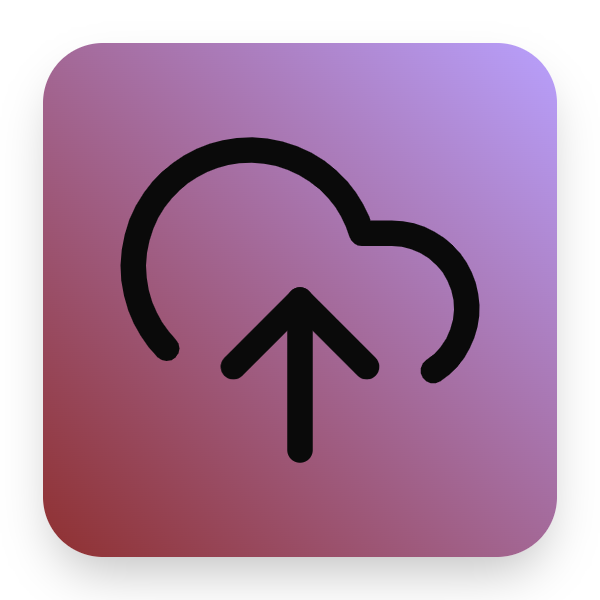

<strong>Obsidian vault cloud storage and sync</strong>

Plugin for Obsidian writing app which stores your vault in the cloud and syncs across devices.

> Under development

## Features

This plugin saves your current vault files to AWS S3 using the cloud upload button as shown above and can sync files from S3 using the save command.

-   To upload click cloud button on sidebar after enabling plugin
-   To download or sync fvault files in the cloud, use _ctrl + p_ and type "save"
-   Only supports syncing of one vault currently
-   AWS cloud credentials need to be saved in credentials.js

## Feature Requests

-   Use SNS to auto notify/sync other divices of vault changes
-   Support multiple vaults
-   Add React UI to button for credential saving and cloud access
